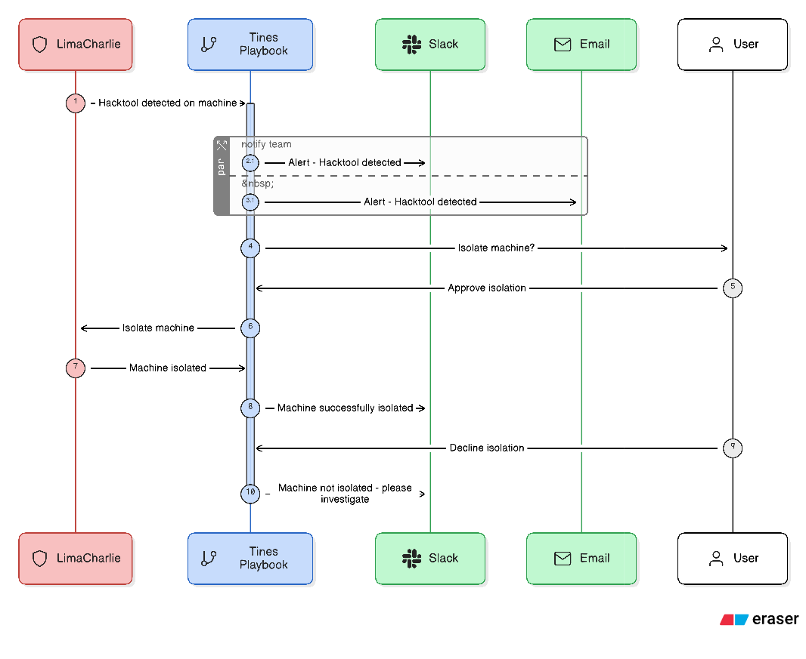
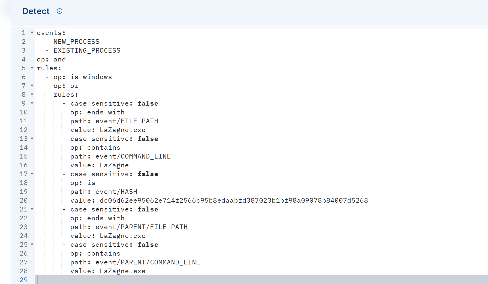
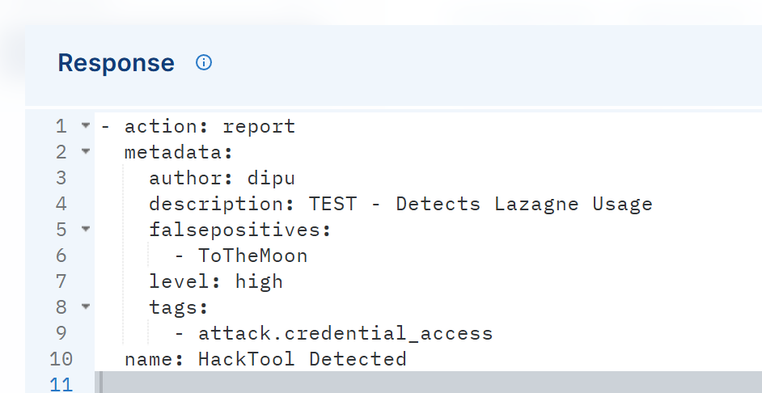
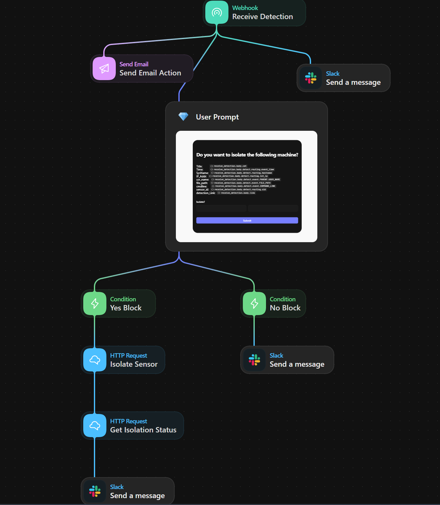
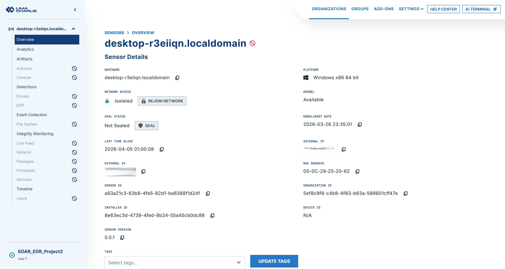
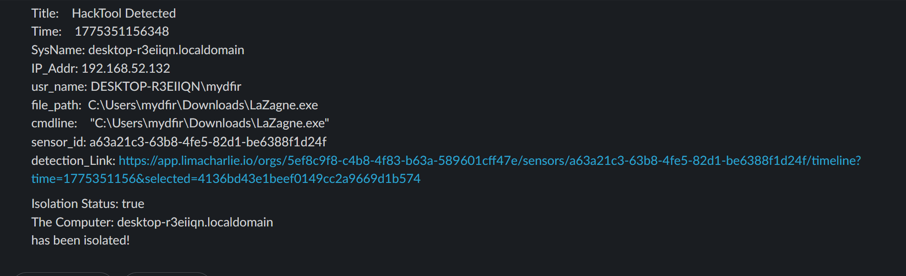
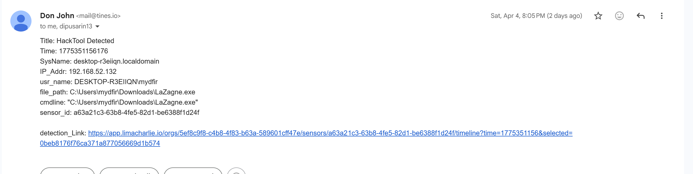

#  EDR + SOAR Automation Project

## 📌 Overview
This project demonstrates automated incident detection and response using LimaCharlie (EDR) and Tines (SOAR).

---

## 🧠 Architecture

---

## ⚙️ Workflow
1. Detect suspicious process (LaZagne)
2. Send alert to Tines
3. Automatically isolate machine
4. Notify via Slack & Email

---

## 🛠️ Tech Stack
- LimaCharlie (EDR)
- Tines (SOAR)
- Slack API
- Email (SMTP)

---

## 📸 Demo

### 🛑 Detection

Detects execution of LaZagne credential dumping tool using LimaCharlie detection rule.

### ⚙️ Automation (Tines)

Helps in Automating the entire workflow using Playbooks(stories).
### 🔒 Isolation

Isolation status of the infected VM in Lima Charlie
### 🔔 Alerts
Alerts sent to the analyst as part of the automation

---

## 🎯 Key Features
- Automated threat detection
- Endpoint isolation
- Real-time alerting
- End-to-end SOC workflow

---

## 🚀 Future Improvements
- Add SIEM integration (Splunk/Sentinel)
- Add threat intelligence enrichment
- Reduce false positives with better rules# EDR-SOAR Automation Project (LimaCharlie + Tines)

## Detection Logic

Custom detection rule identifies:
- LaZagne executable
- Suspicious command-line usage
- Known malicious hash
This helps reduce false positives and improves detection accuracy.
